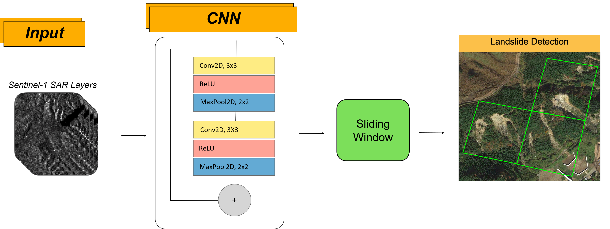

# SAR-based Landslide Rapid Assessment (SAR-LRA)

SAR-LRA is a beta research tool for rapid screening of earthquake-triggered multiple-landslide events using Sentinel-1 SAR imagery and orbit-specific deep neural networks.

> Results are not authoritative landslide inventories. Every output requires review by a qualified remote-sensing or landslide specialist.

## Current status

The repository is being converted from a notebook-led research workflow into a reproducible command-line and container service. The scientific V2 notebook remains the current reference implementation while operational modules are extracted into `src/sar_lra`.

Read these documents before implementation or use:

- [`MODEL_CARD.md`](MODEL_CARD.md) — intended use, training coverage, input bands, limitations, and licensing status;
- [`docs/container-contract.md`](docs/container-contract.md) — planned request and result contract;
- [`docs/repository-layout.md`](docs/repository-layout.md) — ownership of each directory;
- [`model/weights-manifest.json`](model/weights-manifest.json) — weight URLs, architectures, and checksums.

## Reference notebook

[](https://colab.research.google.com/github/lorenzonava96/SAR-and-DL-for-Landslide-Rapid-Assessment/blob/main/notebooks/v2/SAR_LRA_Tool_V2.ipynb)

The notebook acquires Sentinel-1 imagery through Google Earth Engine, creates pre/post composites, and runs separate ascending and descending models.

## Required model input

Each inference raster is a `64 × 64 × 4` patch stack with bands in this exact order:

1. `postVV`
2. `postVH`
3. `diffVV = postVV - preVV`
4. `diffVH = postVH - preVH`

See the model card for units, temporal windows, orbit constraints, and known failure modes.

## Repository structure

```text
assets/              documentation images
docs/                contracts and architecture notes
examples/requests/   sample requests
model/weights/       canonical released weights
notebooks/legacy/    retained V1 research workflows
notebooks/v2/        current scientific reference workflow
schemas/             JSON schemas
scripts/             verification utilities
src/sar_lra/         future operational Python package
tests/               unit and integration tests
```

## Verify model weights

```bash
python scripts/verify_model_weights.py
```

The released checksums are stored in `model/weights-manifest.json`.

## Development

```bash
python -m pip install -e .
python -m compileall src
python -m pytest
```

The package is currently a scaffold. Scientific functions will be extracted from the V2 notebook in the next implementation issue.

## Citation

Nava, L. et al. (2026), “Sentinel-1 SAR-based Globally Distributed Landslide Detection by Deep Neural Networks,” *Geoscientific Model Development*. DOI: [10.5194/gmd-19-167-2026](https://doi.org/10.5194/gmd-19-167-2026).

## Licence

Repository code is distributed under the MIT License. The trained-weight licensing statement remains subject to explicit rights-holder confirmation as documented in `MODEL_CARD.md`.

## Contact

lorenava996@gmail.com




## Package architecture

Reusable code is under `app/`; notebooks are examples only. Installing the base package performs no Earth Engine authentication and does not download model weights.

```bash
pip install .
# or install operational dependencies
pip install '.[geo,inference,earth-engine]'
```

Run local-raster inference with `sar-lra --help`. Earth Engine initialization is explicit through `app.acquisition.earth_engine.initialize(...)`.
