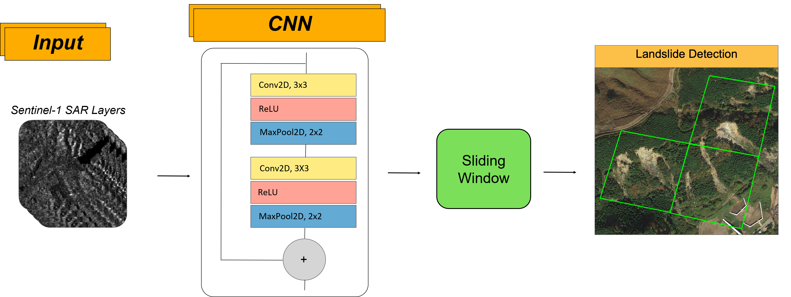

# SAR-based Landslide Rapid Assessment (SAR-LRA)

SAR-LRA is a beta research tool for rapid screening of earthquake-triggered multiple-landslide events using Sentinel-1 SAR imagery and orbit-specific deep neural networks.

> Results are not authoritative landslide inventories. Every output requires review by a qualified remote-sensing or landslide specialist.

## Current status

The repository is being converted from a notebook-led research workflow into a reproducible command-line and container service. The scientific V2 notebook remains the current reference implementation while operational modules are extracted into the installable `app/` package.

Read these documents before implementation or use:

- [`MODEL_CARD.md`](MODEL_CARD.md) — intended use, training coverage, input bands, limitations, and licensing status;
- [`docs/container-contract.md`](docs/container-contract.md) — planned request and result contract;
- [`docs/repository-layout.md`](docs/repository-layout.md) — ownership of each directory;
- [`model/weights-manifest.json`](model/weights-manifest.json) — weight URLs, architectures, and checksums.

## Reference notebook

[](https://colab.research.google.com/github/lorenzonava96/SAR-and-DL-for-Landslide-Rapid-Assessment/blob/main/notebooks/v2/SAR_LRA_Tool_V2.ipynb)

The notebook acquires Sentinel-1 imagery through Google Earth Engine, creates pre/post composites, and runs separate ascending and descending models.

## Required model input

Each inference raster is a `64 × 64 × 4` patch stack with bands in this exact order:

1. `postVV`
2. `postVH`
3. `diffVV = postVV - preVV`
4. `diffVH = postVH - preVH`

See the model card for units, temporal windows, orbit constraints, and known failure modes.

## Repository structure

```text
assets/              documentation images
docs/                contracts and architecture notes
examples/requests/   sample requests
model/weights/       canonical released weights
notebooks/legacy/    retained V1 research workflows
notebooks/v2/        current scientific reference workflow
schemas/             JSON schemas
scripts/             verification utilities
app/                operational Python package
config/             validated YAML configuration
tests/               unit and integration tests
```

## Verify model weights

```bash
python scripts/verify_model_weights.py
```

The released checksums are stored in `model/weights-manifest.json`.

## Development

```bash
python -m pip install -e .
python -m compileall app
python -m pytest
```

Reusable scientific functions are implemented under `app/`; notebooks are thin examples.

## Citation

Nava, L. et al. (2026), “Sentinel-1 SAR-based Globally Distributed Landslide Detection by Deep Neural Networks,” *Geoscientific Model Development*. DOI: [10.5194/gmd-19-167-2026](https://doi.org/10.5194/gmd-19-167-2026).

## Licence

Repository code is distributed under the MIT License. The trained-weight licensing statement remains subject to explicit rights-holder confirmation as documented in `MODEL_CARD.md`.

## Contact

lorenava996@gmail.com




## Package architecture

Reusable code is under `app/`; notebooks are examples only. Installing the base package performs no Earth Engine authentication and does not download model weights.

```bash
pip install .
# or install operational dependencies
pip install '.[geo,inference,earth-engine]'
```

Run local-raster inference with `sar-lra --help`. Earth Engine initialization is explicit through `app.acquisition.earth_engine.initialize(...)`.

## Validated configuration

Use the documented defaults in [`config/default.yaml`](config/default.yaml), or override individual values through CLI options.

```bash
sar-lra predict-raster --config config/default.yaml --help
```

Configuration validation occurs before model or raster processing. The effective configuration is written to result metadata and geospatial output metadata. Scientific rationale and validation rules are documented in [`docs/configuration.md`](docs/configuration.md).

## Command-line interface

The supported CLI now separates validation, acquisition and inference:

```bash
sar-lra validate-roi --roi roi.geojson

sar-lra acquire --roi roi.geojson --event-date 2024-04-03 \
  --orbit ASCENDING --output-dir imagery

sar-lra predict-raster --input imagery/ascending.tif --orbit ASCENDING \
  --weights model/weights/<ascending-weight>.hdf5 --output-dir results

sar-lra predict --roi roi.geojson --event-date 2024-04-03 \
  --orbits ASCENDING,DESCENDING \
  --ascending-weights model/weights/<ascending-weight>.hdf5 \
  --descending-weights model/weights/<descending-weight>.hdf5 \
  --output-dir results
```

Use `--log-format json` for structured JSON-Line diagnostics on stderr. Validation/configuration failures return exit code 3, acquisition/dependency failures 4, processing failures 5, and Ctrl+C returns 130. Generated run artifacts are checked to remain below `--output-dir`. See [`docs/issue-13-cli.md`](docs/issue-13-cli.md).

## Intermediate raster validation

All prepared and Earth Engine rasters are validated before model loading. See `docs/issue-6-raster-validation.md`. Prepared-raster inference can optionally validate spatial coverage with `--roi roi.geojson`.

## Model loss compatibility

The released V2 weights are used for inference with an uncompiled model. The archived reference implementation used a sigmoid output together with `binary_crossentropy(..., from_logits=True)` inside its focal loss. Issue 7 preserves that historical loss as `released_focal_loss()` and exposes a separate `probability_focal_loss()` for controlled experiments; inference outputs do not depend on either compile-time loss. See [`docs/issue-7-focal-loss-consistency.md`](docs/issue-7-focal-loss-consistency.md).

### Sliding-window edge coverage

Inference includes the final horizontal and vertical model window even when raster dimensions are not divisible by the configured window step. Rasters smaller than one model window are edge-padded for model input only; output coordinates remain clipped to observed pixels, and NoData/outside-ROI pixels are masked from detections. See `docs/issue-8-sliding-window-edge-coverage.md`.

## Probability-preserving post-processing

Inference now always writes `probability.tif`, a float32 surface formed from the maximum model-window probability covering each valid pixel. This is distinct from the optional thresholded `detection-mask.tif` and should not be interpreted as a pixel-level segmentation probability. Vector outputs include confidence, orbit and model-version metadata.

A different threshold can be applied without rerunning TensorFlow inference:

```bash
sar-lra threshold-raster \
  --probability-raster results/<request-id>/probability.tif \
  --threshold 0.75 \
  --output results/<request-id>/detection-mask-075.tif
```

See [`docs/issue-9-probability-postprocessing.md`](docs/issue-9-probability-postprocessing.md).

### Detection geometry semantics

SAR-LRA is a window classifier. Output polygons are thresholded **candidate areas**, not exact landslide boundaries. Historical box NMS and conventional IoU NMS are both recorded for diagnostics, but neither defines the operational vector output. See `docs/issue-10-nms-detection-geometry.md`.

## Vector output formats

GeoJSON is the default operational vector output and is always written as `detections.geojson`, including a valid empty `FeatureCollection` when there are no detections. GeoJSON is EPSG:4326. GeoPackage is available with `--vector-format geopackage` (or `both`) and preserves the raster CRS. Candidate geometries are clipped to a supplied ROI. Shapefile is compatibility-only and, when requested with `--shapefile-zip`, is returned as one ZIP archive rather than loose sidecar files. See [`docs/issue-11-vector-output-formats.md`](docs/issue-11-vector-output-formats.md).

## Reference regression tests

Compact ASCENDING and DESCENDING reference-event fixtures are committed under `tests/fixtures/reference/`. They are project-authored synthetic Sentinel-1-like rasters anchored to the public Haiti 2021 and Sumatra 2022 event locations, so normal CI requires neither Earth Engine nor downloaded imagery. Expected patch counts, probability statistics, detection counts and geometry bounds are versioned in `*.expected.json`; see `docs/issue-12-reference-event-regression.md`.

### ROI safety limits

ROI requests are validated before acquisition/inference. The default deployment limits are 10,000 km² area, 500 km bounding-box width/height, and 50,000 vertices. Invalid/self-intersecting geometries, out-of-range coordinates, antimeridian-crossing requests, future event dates, and dates before the Earth Engine Sentinel-1 GRD collection are rejected.

```bash
sar-lra validate-roi --roi roi.geojson
```

The command reports geodesic area and dimensions. Deployment limits can be overridden with `SAR_LRA_MAX_ROI_KM2`, `SAR_LRA_MAX_ROI_WIDTH_KM`, `SAR_LRA_MAX_ROI_HEIGHT_KM`, and `SAR_LRA_MAX_ROI_VERTICES`. See `docs/issue-14-roi-validation-processing-limits.md`.

## CPU Docker image

A pinned CPU-only `linux/amd64` image can be built directly from the repository:

```bash
docker build --platform linux/amd64 -t sar-lra:cpu .
```

The container runs as a non-root user, uses `sar-lra` as its entrypoint, embeds
and verifies the released model weights, and expects read-only inputs under
`/input` and writable results under `/output`. See
[`docs/issue-15-cpu-docker.md`](docs/issue-15-cpu-docker.md) for prepared-raster
and Earth Engine examples.


## Flexible acquisition providers

`POST /v1/predict`, `POST /v1/jobs`, `sar-lra acquire`, and `sar-lra predict` support `auto`, `planetary-computer`, and `earth-engine`. Secrets stay outside request bodies. `auto` uses `SAR_LRA_ACQUISITION_PROVIDER` when set, otherwise prefers `PC_SDK_SUBSCRIPTION_KEY` and then conventional Earth Engine/ADC credential files. `/v1/predict-raster` and `sar-lra predict-raster` remain fully provider-independent and need no imagery-provider credential. See [`docs/ACQUISITION_PROVIDERS.md`](docs/ACQUISITION_PROVIDERS.md).

Planetary Computer uses `sentinel-1-rtc`, filters IW VV/VH scenes by orbit, chooses a common relative orbit, converts RTC intensity to dB, and constructs the standard four-band stack. Planetary Computer Sentinel-1 RTC asset access requires `PC_SDK_SUBSCRIPTION_KEY`. Earth Engine supports service-account/ADC/Earth Engine credential files or attached cloud identity.

## Secure Earth Engine authentication

Earth Engine credentials are runtime inputs and are never embedded in the container. The recommended container pattern is a read-only mounted service-account/ADC file:

```bash
docker run --rm \
  -e GOOGLE_APPLICATION_CREDENTIALS=/run/secrets/gee.json \
  -v "$PWD/gee.json:/run/secrets/gee.json:ro" \
  -v "$PWD/input:/input:ro" \
  -v "$PWD/results:/output" \
  sar-lra:cpu acquire --project YOUR_PROJECT --roi /input/roi.geojson \
  --event-date 2024-04-03 --orbit ASCENDING --output-dir /output
```

ADC, a read-only host `~/.config/earthengine` mount, and cloud Workload Identity/attached service accounts are also supported. See `docs/issue-16-earth-engine-authentication.md`. Prepared-raster inference requires no Google credentials.

### Optional NVIDIA GPU container

Issue 17 adds a separate GPU-capable image; the CPU image remains the default.

```bash
docker build --platform linux/amd64 -f Dockerfile.gpu -t sar-lra:gpu .
docker run --rm --gpus all \
  --entrypoint python sar-lra:gpu \
  /opt/sar-lra/scripts/container_gpu_smoke_test.py
```

Run normal commands with `sar-lra:gpu` and `--gpus all`. The host must provide an NVIDIA driver and NVIDIA Container Toolkit. A missing GPU is treated as a deployment error for the GPU smoke test rather than silently passing as CPU execution. See `docs/issue-17-gpu-docker.md`.

## Bounded-memory inference

Sliding-window model patches are predicted incrementally rather than accumulated
for the full ROI. Production runs use disk-backed probability/mask work arrays,
and GeoTIFF outputs are written in row chunks. Control memory with `--batch-size`,
`--inference-workers`, and `--output-rows-per-chunk`. See
`docs/issue-18-streamed-inference.md`.

## HTTP API

An optional FastAPI service wraps the same validated pipeline as the CLI. Install with `.[api]` and run `sar-lra-api`, or override the CPU/GPU container entrypoint. It provides `/healthz`, `/readyz`, `/v1/predict-raster`, `/v1/predict`, and generated OpenAPI docs. Filesystem access is restricted to configured input/output roots and inference concurrency is bounded. See `docs/issue-19-fastapi-service.md`.

## Asynchronous API jobs

Long-running HTTP work can be queued through Redis instead of keeping a request open:

```bash
docker compose up --build
```

Submit with `POST /v1/jobs`, poll `GET /v1/jobs/{job_id}`, and fetch the completed result from `GET /v1/jobs/{job_id}/result`. The worker entry point is `sar-lra-worker`. Job metadata retention is controlled by `SAR_LRA_JOB_RETENTION_SECONDS` (default: 86400 seconds). See `docs/issue-20-asynchronous-jobs.md`.

### Async worker resource controls

Async deployments support bounded queue depth, per-job execution timeouts, retry caps, cancellation cleanup, a minimum free-disk floor, and container CPU/memory/PID limits. See `docs/issue-21-resource-timeout-cancellation.md`.

Key environment variables:

```text
SAR_LRA_JOB_TIMEOUT_SECONDS=3600
SAR_LRA_JOB_MAX_ATTEMPTS=3
SAR_LRA_MAX_QUEUED_JOBS=100
SAR_LRA_MIN_FREE_DISK_MB=1024
```

## Published container images

Issue 22 adds the GHCR release workflow. On `main`, the CPU image is published as `ghcr.io/<owner>/sar-lra`; semantic release tags such as `v1.0.0` publish both CPU and GPU images with `1.0.0`, `1.0`, `1`, `latest`, and `sha-<commit>` aliases. Each published image is SBOM-generated, Trivy-scanned, and keylessly signed with Cosign. See `docs/issue-22-ghcr-release.md`.

## End-user deployment guide

For a single notebook-free path from container pull to sample prediction, Earth Engine authentication, prepared-raster inference, API/Compose deployment, output interpretation, troubleshooting, scientific limitations, and citation, use [`docs/end-user-deployment.md`](docs/end-user-deployment.md). The image includes a small synthetic smoke-test raster under `/opt/sar-lra/examples/quickstart/`.

## Docker Compose deployment

A complete local/reference stack is available in `docker-compose.yml` with the
API, worker, Redis, MinIO, health checks, persistent volumes, and an optional
CLI-only profile. See `docs/issue-23-compose-deployment.md`.

```bash
cp .env.example .env
docker compose up --build -d
```

For CLI-only use, no queue or object store is required:

```bash
docker compose --profile cli run --rm cli --help
```

## Documentation index

The complete operator/user reference starts at [`docs/README.md`](docs/README.md), with dedicated references for the HTTP API, acquisition providers and credentials, CLI, configuration, deployment, outputs, architecture, security, and troubleshooting. The running API also serves Swagger UI at `/docs`, ReDoc at `/redoc`, and OpenAPI JSON at `/openapi.json`.
